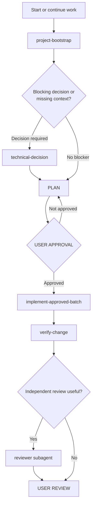
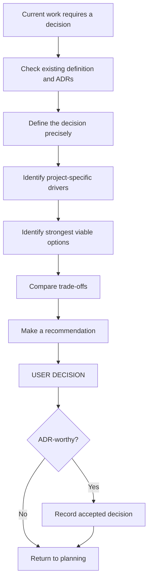
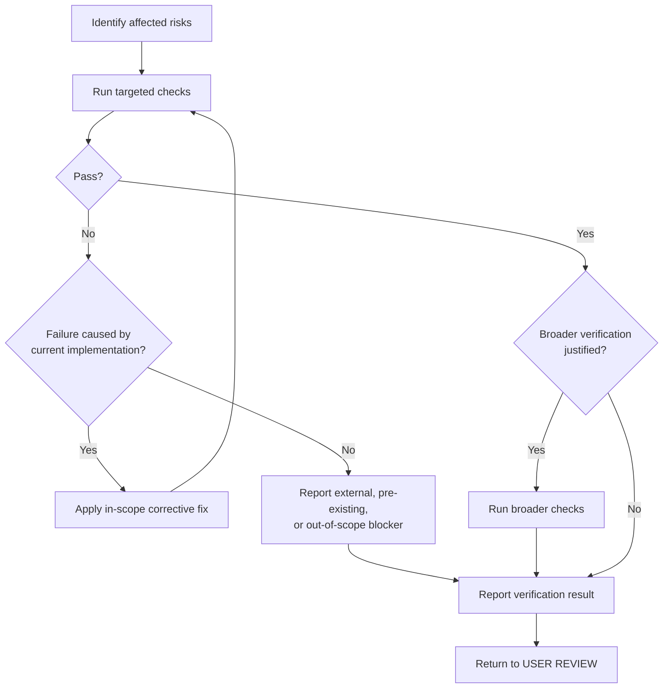

# Agent Skills

This directory contains reusable Agent Skills for the repository's
human-controlled development workflow.

The Skills are operational procedures: they teach an agent **how to perform a
specific kind of work** when that work becomes relevant.

They do not define the product, replace engineering Rules, or grant approval to
modify the repository.

The repository-wide behavioral contract remains
[`AGENTS.md`](../AGENTS.md).

## Directory Layout

```text
.agents/
├── README.md
└── skills/
    ├── project-bootstrap/
    │   └── SKILL.md
    ├── technical-decision/
    │   └── SKILL.md
    ├── implement-approved-batch/
    │   └── SKILL.md
    └── verify-change/
        └── SKILL.md
```

Each Skill is a directory containing a `SKILL.md` file.

## Why `.agents/skills/`?

Cursor supports `.agents/skills/` as a project-level Agent Skills directory.

This repository uses it intentionally because Agent Skills are designed as a
portable, version-controlled format rather than a Cursor-only repository
mechanism.

Cursor discovers the available Skills and can load one when its `name`,
`description`, and current task make it relevant.

A Skill can also be selected manually from Agent chat with `/`.

The Skills in this repository are left available for automatic selection.
They do not set:

```yaml
disable-model-invocation: true
```

because normal prompts such as:

```text
Start the project.
```

should be enough for the appropriate workflow to become relevant.

## Skills in the Repository Mental Model

Skills are only one layer of the repository's agent architecture.

|          Component           | Question it answers                                       |
| :--------------------------: | :-------------------------------------------------------- |
|         `AGENTS.md`          | How is the agent allowed to work?                         |
|       `.cursor/rules/`       | How should the code be engineered?                        |
| `docs/project/definition.md` | What are we building?                                     |
|  `docs/project/decisions/`   | Why was an important technical choice accepted?           |
|      `.agents/skills/`       | How should a specialized workflow be performed?           |
|      `.cursor/agents/`       | When should independent specialist analysis be delegated? |
|       `.cursor/hooks/`       | Which operations need deterministic runtime guardrails?   |

For a broader comparison of Cursor customization mechanisms, see
[`.cursor/README.md`](../.cursor/README.md).

## Workflow Overview

The four Skills support different parts of the same development lifecycle.



The complete authoritative state model is defined in
[`AGENTS.md`](../AGENTS.md).

A Skill implements a portion of that model; it does not own the model.

## Approval Boundaries

A central design principle of these Skills is that different kinds of approval
remain separate.

```text
recommendation
≠
decision

decision
≠
implementation approval

recorded ADR
≠
implementation approval

implementation approval
≠
additional-scope approval

successful verification
≠
user review

user review
≠
commit approval

commit approval
≠
push approval
```

A Skill must return control when it reaches one of these boundaries rather than
silently advancing to the next state.

## `project-bootstrap`

Location:

```text
.agents/skills/project-bootstrap/SKILL.md
```

### Purpose

`project-bootstrap` is the normal entry point when:

- beginning a project from the repository;
- resuming a project when the next milestone is not established;
- asking the agent to continue development from repository context.

Typical prompts include:

```text
Start the project.
```

```text
Continue the project.
```

```text
What should we work on next?
```

### What it does

The Skill reads enough repository context to determine the correct next step,
including when relevant:

- `AGENTS.md`;
- `docs/project/definition.md`;
- the ADR policy;
- existing accepted ADRs;
- applicable engineering Rules;
- the current repository structure and implementation state.

It then identifies the **smallest useful next milestone**.

### Possible outcomes

The Skill normally stops at one of three outcomes:

```text
Missing material context
→ DISCUSS
```

```text
Meaningful blocking choice
→ DECIDE
```

```text
No blocker
→ PLAN
→ wait for USER APPROVAL
```

### What it must not do

`project-bootstrap` does not mean:

```text
generate the whole application
```

and:

```text
Start the project.
```

does not authorize implementation.

It authorizes the bootstrap workflow: understand the repository, find the next
useful milestone, surface blockers, and prepare the next plan.

## `technical-decision`

Location:

```text
.agents/skills/technical-decision/SKILL.md
```

### Purpose

`technical-decision` handles a meaningful technical or architectural decision
that current or immediately upcoming work actually depends on.

Examples include choices affecting:

- architecture;
- authentication or authorization;
- security;
- persistent data;
- external contracts;
- dependencies;
- infrastructure;
- deployment;
- operational behavior;
- long-term maintainability.

### Decision process

Conceptually:



### Just-in-time decisions

The Skill must not resolve every architectural unknown during project setup.

A decision should be made when it is:

- required by current work; or
- required by the immediately upcoming implementation.

If the project does not yet need the answer, defer it.

This avoids speculative architecture and allows decisions to be made with
better context.

### Options

The Skill should present the strongest viable options.

Up to three alternatives is often useful, but three is not a quota.

It must not invent a weak third option merely to create a three-column
comparison.

### User decision

The agent may:

- explain;
- compare;
- recommend.

The user makes the decision.

Agreement with the recommendation is a decision only when the user's intent is
clear.

Even then, the decision does not automatically authorize implementation.

### ADR recording

When an accepted decision is significant enough to preserve, the Skill records
it according to:

```text
docs/project/decisions/README.md
```

The corresponding ADR should exist before implementation that materially
depends on that decision begins.

Recording an ADR preserves the decision; it does not grant permission to
implement it.

## `implement-approved-batch`

Location:

```text
.agents/skills/implement-approved-batch/SKILL.md
```

### Purpose

This Skill performs implementation only after:

1. a concrete batch has been planned;
2. meaningful blocking decisions have been resolved;
3. the user has explicitly approved implementation of that batch.

### Scope is frozen

Once implementation starts, the approved batch is treated as the maximum
intended scope.

The Skill may perform necessary, uncontroversial details required to implement
the approved plan.

It must not add adjacent work merely because it appears useful.

Examples of unapproved expansion include:

- unrelated cleanup;
- speculative features;
- broad refactoring;
- new abstractions for hypothetical future needs;
- an additional dependency not covered by the approved plan;
- unrelated infrastructure work.

### New decisions discovered during implementation

If implementation reveals a meaningful unresolved choice, the Skill stops.

Conceptually:

```text
IMPLEMENT
    ↓
new meaningful decision discovered
    ↓
STOP
    ↓
DECIDE
```

It must not silently choose whichever option is fastest.

### Dependencies and persistent data

Dependency changes and persistent-data changes remain meaningful scope.

If a new dependency, destructive migration, data conversion, or other material
persistent-state change becomes necessary but was not approved, implementation
returns control rather than extending the batch.

### Completion

The Skill ends by handing the completed implementation to verification.

It does not continue into:

- unrelated work;
- commit;
- push;
- deployment.

## `verify-change`

Location:

```text
.agents/skills/verify-change/SKILL.md
```

### Purpose

`verify-change` establishes reasonable confidence in a completed implementation
batch before user review.

Its goal is:

> **confidence proportional to risk**

rather than:

> run every available command.

### Verification strategy

The Skill starts with the risks introduced by the change and chooses the
smallest meaningful verification set.

Depending on the project, this may include:

- focused tests;
- integration tests;
- API tests;
- static analysis;
- type checking;
- linting;
- formatting checks;
- framework checks;
- migration consistency checks;
- targeted runtime validation.

Targeted checks normally come before broad checks.



### Corrective fixes

Verification may repair a failure caused by the current implementation only
when the fix:

- remains inside the approved intent;
- requires no new meaningful decision;
- adds no new scope;
- adds no unapproved dependency;
- introduces no unapproved persistent-data change;
- does not materially alter the accepted design.

After a corrective fix, the affected verification must be rerun.

### Verification result

The Skill classifies and reports the outcome rather than hiding uncertainty.

A successful verification does not authorize:

- another implementation batch;
- commit;
- push;
- deployment.

It returns control to user review.

## Independent Review Is Not a Fifth Skill

The repository also contains:

```text
.cursor/agents/reviewer.md
```

The reviewer is intentionally a **Subagent**, not another Skill.

That distinction is important.

`verify-change` is a workflow performed by the current agent.

The reviewer provides an independent perspective in a separate agent context.

Conceptually:

```text
implementation
    ↓
verify-change
    ↓
optional independent reviewer
    ↓
user review
```

The reviewer is read-only and reports findings rather than modifying the
implementation.

See [`.cursor/README.md`](../.cursor/README.md) for the broader distinction
between Skills and Subagents.

## Skills Do Not Hard-chain Each Other

The Skills intentionally do not form a brittle controller in which one Skill
directly invokes the next by name.

Instead:

1. `AGENTS.md` defines the workflow state and boundaries;
2. the current repository context indicates what state has been reached;
3. Cursor selects the relevant Skill when the next specialized procedure is
   needed.

This keeps each Skill independently understandable and reduces coupling between
them.

For example, the end of implementation conceptually produces:

```text
state = VERIFY
```

rather than:

```text
force-run verify-change
```

The relevant verification Skill can then be selected from context.

## Automatic vs Manual Invocation

By default, the Skills in this repository are available for automatic
selection.

Their frontmatter contains:

```yaml
name: ...
description: ...
```

and intentionally does not contain:

```yaml
disable-model-invocation: true
```

The `description` is therefore important: it tells the agent what the Skill
does and when it is relevant.

Manual invocation remains useful when the user wants to select a workflow
explicitly.

Examples include:

```text
/project-bootstrap
```

```text
/technical-decision
```

```text
/implement-approved-batch
```

```text
/verify-change
```

Manual invocation does not override the approval rules in `AGENTS.md`.

For example, manually selecting:

```text
/implement-approved-batch
```

without an actually approved batch does not create implementation permission.

## Adding a New Skill

Do not add a Skill simply because a task has several steps.

A new Skill is justified when the repository develops a **reusable,
recognizable workflow** that:

- occurs repeatedly or is likely to recur;
- has meaningful domain or procedural knowledge;
- benefits from being loaded on demand;
- has a clear triggering context;
- is distinct from existing Skills;
- is not better expressed as a Rule, Subagent, Hook, or ordinary prompt.

Before creating one, ask:

```text
Is this reusable workflow knowledge?
```

If the answer is no, a Skill is probably unnecessary.

### Skill naming

Use a short lowercase hyphenated name that describes the capability.

The Skill name should match the directory containing `SKILL.md`.

Example:

```text
.agents/skills/example-workflow/SKILL.md
```

```yaml
---
name: example-workflow
description: ...
---
```

### Description quality

The `description` should explain both:

1. what the Skill does;
2. when it should be used.

A vague description makes automatic selection less reliable.

Prefer:

```text
Verify a completed implementation batch with risk-appropriate targeted
checks and return the result for user review.
```

over:

```text
Helps with verification.
```

### Keep Skills focused

A Skill should have one coherent responsibility.

Avoid creating one enormous Skill that attempts to:

```text
plan
→ decide
→ implement
→ verify
→ review
→ commit
→ push
```

The explicit boundaries between these stages are a core property of the
repository workflow.

## Maintaining Existing Skills

When changing a Skill:

- preserve the approval model in `AGENTS.md`;
- avoid duplicating engineering Rules;
- avoid embedding product-specific requirements into a reusable Skill;
- keep the triggering description accurate;
- avoid speculative procedures;
- keep the Skill useful independently of one particular project;
- update documentation when its responsibility materially changes.

If a project requires specialized behavior that should not apply to other
projects, prefer a project-specific extension rather than weakening the
general Skill.

## What Should Not Live in a Skill?

Normally keep these elsewhere:

| Content                              |       Better location        |
| :----------------------------------- | :--------------------------: |
| Product goals and requirements       | `docs/project/definition.md` |
| Accepted architectural choices       |  `docs/project/decisions/`   |
| Persistent coding conventions        |       `.cursor/rules/`       |
| Human approval policy                |         `AGENTS.md`          |
| Deterministic command enforcement    |       `.cursor/hooks/`       |
| Independent review role              |      `.cursor/agents/`       |
| Temporary/private reference material |          `.local/`           |

This prevents Skills from becoming a second, conflicting source of truth.

## Portability

The `.agents/skills/` location is intentionally chosen to keep Skill definitions
less coupled to Cursor-specific repository structure.

The actual workflow still references repository conventions such as
`AGENTS.md`, project definitions, and ADRs, so portability does not mean the
Skills are context-free.

It means their format and responsibility are not tied unnecessarily to
`.cursor/skills/`.

## Further Reading

Official references:

- [Cursor Agent Skills](https://cursor.com/docs/skills)
- [Cursor customization overview](https://cursor.com/docs/customize-cursor)
- [Agent Skills open standard](https://agentskills.io/)

Repository documentation:

- [`../AGENTS.md`](../AGENTS.md)
- [`../.cursor/README.md`](../.cursor/README.md)
- [`../docs/project/definition.md`](../docs/project/definition.md)
- [`../docs/project/decisions/README.md`](../docs/project/decisions/README.md)
