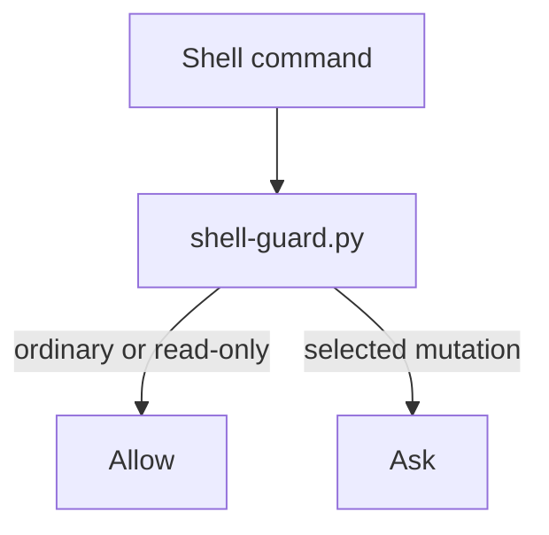
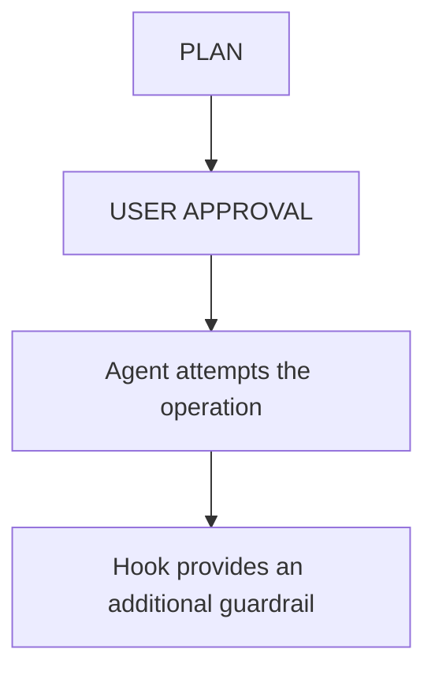

<!-- Author: Emad Helmi <s.emad.helmi@gmail.com> (@emad.helmi) -->

# Cursor Integration

This directory contains the repository's Cursor-specific integration layer.

It complements:

- [`AGENTS.md`](../AGENTS.md), which defines the human-agent working agreement;
- [`.agents/skills/`](../.agents/skills/), which contains reusable agent
  workflows;
- [`docs/project/`](../docs/project/), which contains the project definition and
  accepted technical decisions.

The goal is to give Cursor useful engineering context, independent review, and
deterministic guardrails without turning the repository into an autonomous-agent
system.

## Directory Layout

```text
.cursor/
├── README.md
├── agents/
│   └── reviewer.md
├── hooks/
│   └── shell-guard.py
├── hooks.json
└── rules/
    ├── README.md
    ├── architecture/
    ├── django/
    ├── meta/
    ├── repository/
    └── python/
```

Cursor also consumes the Agent Skills stored at:

```text
.agents/skills/
```

They live outside `.cursor/` intentionally because the Agent Skills format is
more portable, while Rules, Subagents, and Hooks are part of the Cursor-specific
integration layer.

## Which Mechanism Should I Use?

Cursor provides several customization mechanisms. They solve different
problems and should not be used interchangeably.

|  Mechanism  | Purpose                                   | Use it when                                                                                   |
| :---------: | :---------------------------------------- | :-------------------------------------------------------------------------------------------- |
| `AGENTS.md` | Human-agent working agreement             | The instruction controls how an agent is allowed to work                                      |
|    Rules    | Persistent or scoped engineering guidance | The agent should know a coding, framework, architecture, or repository convention             |
|   Skills    | Reusable workflows loaded when relevant   | A specialized multi-step procedure should be available without occupying context all the time |
|  Subagents  | Independent specialized assistants        | Work benefits from a separate context or independent perspective                              |
|    Hooks    | Deterministic lifecycle interception      | An operation needs runtime checking, automation, or enforcement                               |
|  Commands   | Explicit reusable `/` prompts             | A simple workflow should always be started manually                                           |
|     MCP     | External tools and data                   | The agent needs structured access to another system                                           |
|   Plugins   | Distributable bundles                     | Several Cursor components should be packaged and shared together                              |

A useful rule of thumb is:

> **Use instructions for judgment, Skills for workflows, Subagents for isolated
> expertise, and Hooks for deterministic runtime control.**

## `AGENTS.md` vs Rules

Cursor supports both repository-level [`AGENTS.md`](../AGENTS.md) instructions
and Project Rules under [`.cursor/rules/`](rules/).

This repository deliberately uses both, with different responsibilities.

### `AGENTS.md`

`AGENTS.md` defines **how the agent is allowed to work**.

It governs areas such as:

- discussion before meaningful decisions;
- explicit implementation approval;
- implementation-batch scope;
- verification boundaries;
- user review;
- commit and push approval;
- handling uncertainty and blockers.

### Rules

`.cursor/rules/` defines **how the code should be engineered**.

Rules cover areas such as:

- repository-wide file conventions;
- Python conventions;
- typing and testing;
- observability;
- Clean Architecture and DDD guidance;
- Django / DRF behavior;
- organization-specific standards;
- rule compatibility and precedence.

Do not duplicate the same policy in both places.

For detailed Rule organization and profiles, see
[`rules/README.md`](rules/README.md).

## Rules

Project Rules are version-controlled `.mdc` files under `.cursor/rules/`.

This repository groups them by responsibility:

|    Directory    | Purpose                                                           |
| :-------------: | :---------------------------------------------------------------- |
|     `meta/`     | Compatibility, Markdown guidance, compliance, and Rule governance |
|  `repository/`  | Cross-language and cross-framework repository conventions         |
|    `python/`    | General Python engineering, tooling, testing, and observability   |
| `architecture/` | Proportional Clean Architecture / DDD guidance                    |
|    `django/`    | Django / DRF, ORM, migrations, transactions, and testing          |

Rule folder names are organizational. Each `.mdc` file's frontmatter determines
how Cursor applies it.

When adding a new Rule, use the classification and placement guidance in
[`rules/README.md`](rules/README.md).

### Personal conventions

Files whose names contain `convention` are treated as personal, local-only
preferences and are normally excluded from Git.

Examples:

```text
.cursor/rules/repository/conventions.mdc
.cursor/rules/python/conventions.mdc
.cursor/rules/django/test-conventions.mdc
```

This keeps personal preferences separate from shared engineering standards.

## Skills

Reusable Agent Skills live at:

```text
.agents/skills/
```

Skills provide specialized procedures that Cursor can load when relevant.

This repository currently provides:

|           Skill            | Responsibility                                                                |
| :------------------------: | :---------------------------------------------------------------------------- |
|    `project-bootstrap`     | Understand the repository and identify the next useful milestone              |
|    `technical-decision`    | Compare meaningful technical options and record accepted ADR-worthy decisions |
| `implement-approved-batch` | Implement only a previously planned and approved scope                        |
|      `verify-change`       | Perform risk-appropriate verification before user review                      |

Skills do not define the repository's approval state machine.

[`AGENTS.md`](../AGENTS.md) remains authoritative; Skills provide reusable
procedures for executing parts of that workflow.

Use a **Rule** for guidance the agent should routinely know.

Use a **Skill** for a specialized workflow the agent should load only when it
becomes relevant.

## Subagents

Custom project Subagents live under:

```text
.cursor/agents/
```

A Subagent is useful when a task benefits from:

- a separate context window;
- an independent perspective;
- specialized instructions;
- isolated analysis;
- delegated or parallel work.

### Reviewer

This repository currently provides:

```text
.cursor/agents/reviewer.md
```

The reviewer is an independent review pass for meaningful completed changes.

It is intentionally configured as:

```yaml
readonly: true
is_background: false
```

Its job is to inspect and report, not repair.

It reviews areas such as:

- correctness;
- approved-scope compliance;
- project requirements;
- accepted ADRs;
- applicable Rules;
- architecture;
- security;
- regression risk;
- test adequacy.

A review with no material findings is a valid result.

The custom reviewer complements Cursor's built-in review capabilities rather
than replacing every specialized review tool.

## Hooks

Hooks are deterministic scripts that run at defined points in Cursor's agent
lifecycle.

Project Hook registration lives in:

```text
.cursor/hooks.json
```

Hook implementations live under:

```text
.cursor/hooks/
```

### Shell guard

This repository currently registers:

```text
.cursor/hooks/shell-guard.py
```

through the `beforeShellExecution` lifecycle event.

Its purpose is to provide an additional deterministic guard around selected
state-changing or high-impact shell commands.

Conceptually, ordinary or read-only commands are allowed, and selected
mutations ask for approval:



Examples of operations that may require approval include:

```text
git commit
git push
git rebase
uv add
uv remove
sudo ...
rm -rf ...
docker system prune
```

The Hook is a **workflow safety net**, not a complete shell-security sandbox.

The behavioral contract still comes from [`AGENTS.md`](../AGENTS.md):



### Extending Hooks

Add project-specific Hook behavior only for a concrete requirement.

Good examples include:

- protecting production resources;
- detecting secrets or PII;
- enforcing deployment restrictions;
- validating project-specific high-risk operations.

Do not add Hooks merely because Cursor exposes an event for them.

## Commands

Cursor Commands are reusable prompts invoked explicitly with `/`.

This repository currently defines no custom Commands.

That is intentional: the existing multi-step workflows are better represented
as Skills because they can be discovered when relevant.

A Command may still be appropriate for a simple action that should always be
started manually.

Do not create a Command merely as another alias for an existing Skill.

## MCP

Model Context Protocol (MCP) connects Cursor to external tools, APIs, services,
and data sources.

This repository does not preconfigure an MCP server.

Add MCP only when a real project needs structured access to an external system,
for example:

- issue trackers;
- observability platforms;
- databases;
- internal developer platforms;
- domain-specific APIs.

Do not add MCP integrations speculatively during initialization.

## Plugins

Cursor Plugins can package Rules, Skills, Subagents, Commands, MCP servers, and
Hooks into a distributable unit.

This repository uses project-local Cursor configuration rather than packaging
its Cursor integration as a Cursor Plugin.

Packaging the Cursor-specific layer as a Plugin may make sense later if it needs
to be installed and updated independently across many repositories.

That is a distribution decision, not a requirement for normal project
development.

## Choosing the Right Mechanism

When adding new customization, start with the problem rather than the available
feature.

| Need                                                    |   Prefer    |
| :------------------------------------------------------ | :---------: |
| Human-agent approval or workflow policy                 | `AGENTS.md` |
| Coding, framework, architecture, or repository guidance |    Rule     |
| Reusable specialized multi-step workflow                |    Skill    |
| Independent specialist with isolated context            |  Subagent   |
| Deterministic lifecycle enforcement or automation       |    Hook     |
| Simple manually invoked reusable prompt                 |   Command   |
| External system or structured data access               |     MCP     |
| Installable bundle of several Cursor components         |   Plugin    |

If two mechanisms appear to solve the same problem, prefer the one with the
narrower responsibility and avoid duplicating instructions.

## Portability

These parts are specifically tied to Cursor:

```text
.cursor/rules/
.cursor/agents/
.cursor/hooks/
.cursor/hooks.json
```

These parts are intentionally less Cursor-specific:

```text
AGENTS.md
.agents/skills/
docs/project/
```

The project definition and ADR history should remain useful regardless of which
coding agent is used in the future.

## Maintaining This Integration

Keep the Cursor integration proportional to the repository's actual needs.

### Stable baseline components

The following components normally remain stable unless the repository has a
concrete reason to change its workflow or enforcement model:

```text
.cursor/agents/reviewer.md
.cursor/hooks.json
.cursor/hooks/shell-guard.py
```

### Rule directories

Keep only Rule directories that are relevant to the repository's actual stack
and context.

For example, remove a framework-specific Rule directory when it no longer
applies.

### Extend only when needed

Add new Rules, Subagents, Hooks, Commands, or MCP integrations only when the
repository develops a concrete recurring requirement.

Do not build a large agent platform around a small application merely because
the mechanisms are available.

## Troubleshooting

### A Rule is not being applied

Check:

- the `.mdc` extension;
- Rule frontmatter;
- `globs` for file-scoped Rules;
- `description` for intelligently applied Rules;
- whether the current task is actually relevant.

See [`rules/README.md`](rules/README.md) for more detail.

### A Skill is not being selected

Check its `name` and `description` in `SKILL.md`.

The description should make clear when the Skill is relevant. Skills can also
be invoked manually when needed.

### The reviewer modifies files

Confirm that its frontmatter contains:

```yaml
readonly: true
is_background: false
```

Changing those values should be an intentional workflow decision.

### A Hook is not running

Check:

- `.cursor/hooks.json`;
- the registered lifecycle event;
- the Hook command path;
- script runtime availability;
- Cursor's Hook logs;
- whether the current execution environment supports the event.

## Further Reading

Official Cursor documentation:

- [Customize Cursor](https://cursor.com/docs/customize-cursor)
- [Rules and `AGENTS.md`](https://cursor.com/docs/rules)
- [Agent Skills](https://cursor.com/docs/skills)
- [Subagents](https://cursor.com/docs/subagents)
- [Hooks](https://cursor.com/docs/hooks)
- [Model Context Protocol (MCP)](https://cursor.com/docs/mcp)
- [Cursor documentation](https://cursor.com/docs)

Repository-specific documentation:

- [`../AGENTS.md`](../AGENTS.md)
- [`rules/README.md`](rules/README.md)
- [`../docs/project/definition.md`](../docs/project/definition.md)
- [`../docs/project/decisions/README.md`](../docs/project/decisions/README.md)
