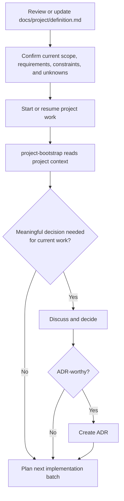
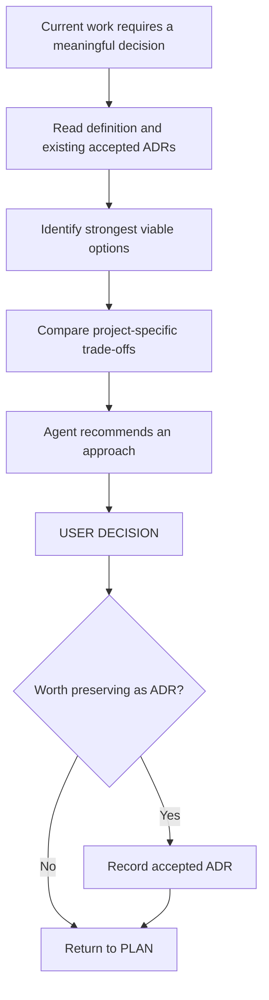

# Project Documentation

This directory contains the project-specific source of truth for **what is being
built** and **why important technical decisions were accepted**.

It is intentionally separate from:

- [`AGENTS.md`](../../AGENTS.md), which defines how humans and agents work
  together;
- [`.cursor/rules/`](../../.cursor/rules/), which defines reusable engineering
  guidance;
- [`.agents/skills/`](../../.agents/skills/), which defines specialized agent
  workflows;
- [`.cursor/hooks/`](../../.cursor/hooks/), which provides deterministic runtime
  guardrails.

The goal of this directory is to keep product intent and architectural history
clear, reviewable, and useful to both humans and coding agents.

## Directory Layout

```text
docs/project/
├── README.md
├── definition.md
└── decisions/
    ├── README.md
    ├── template.md
    └── 0001-....md
```

The responsibilities are deliberately different:

|        Location         | Responsibility                                                                                    |
| :---------------------: | :------------------------------------------------------------------------------------------------ |
|     `definition.md`     | What the project must achieve, including scope, requirements, constraints, and important unknowns |
|  `decisions/README.md`  | How Architecture Decision Records are created and maintained                                      |
| `decisions/template.md` | Reusable structure for a new ADR                                                                  |
|  `decisions/NNNN-*.md`  | Why an accepted meaningful technical choice was made                                              |

A concise mental model is:

```text
definition.md
→ WHAT and WHY at the product/requirement level

decisions/
→ WHY at the technical-decision level
```

## Working With Project Documentation

This directory should reflect the actual project rather than an inherited
template or repository origin.

When establishing or revisiting project context, use the following sequence:



In practical terms:

1. keep `definition.md` aligned with the project's real requirements, scope,
   constraints, and Known Unknowns;
2. keep `decisions/README.md` and `decisions/template.md` as the ADR policy and
   reusable ADR structure;
3. do **not** pre-create ADR files for every unresolved technical question;
4. start or resume development from the current repository state;
5. create ADRs only when an actual meaningful decision becomes necessary and
   is accepted.

## `definition.md`

[`definition.md`](definition.md) describes the project itself.

It should answer questions such as:

- What problem are we solving?
- Who or what is the system for?
- What outcomes are required?
- What behavior is explicitly in scope?
- What behavior is explicitly out of scope?
- Which technical constraints are already mandatory?
- Which security properties must be preserved?
- Which external systems must be integrated?
- What important information is still unknown?
- What does project-level completion mean?

It should remain understandable without requiring the reader to know the
implementation.

## What Belongs in the Project Definition?

The project definition is primarily for:

- product goals;
- non-goals;
- user journeys;
- scope;
- functional requirements;
- confirmed technical constraints;
- high-level architecture principles;
- authentication and identity requirements;
- integration requirements;
- persistence requirements;
- UI requirements;
- security requirements;
- testing and quality expectations;
- deployment and runtime requirements;
- known unknowns;
- project-level Definition of Done.

The project definition keeps these concerns separate so that product intent
does not collapse into one large free-form specification.

## Requirements vs Technical Decisions

This distinction is one of the most important concepts in the repository.

A **requirement** describes behavior, an outcome, or a constraint the project
must satisfy.

A **technical decision** chooses how the project will satisfy some requirement
or constraint when multiple meaningful approaches are possible.

For example:

### Requirement

```text
Users must be able to authenticate securely.
```

### Technical decision

```text
Browser authentication will use server-side sessions.
```

The first belongs in:

```text
docs/project/definition.md
```

The second may belong in:

```text
docs/project/decisions/000N-browser-authentication.md
```

after the choice is actually needed and accepted.

Do not hide product requirements inside ADRs.

Do not put detailed option comparisons into the project definition.

## Requirement vs Confirmed Technical Constraint

Some technical choices are not decisions available to the project because they
are already mandatory.

Examples might include:

```text
Python >= 3.13 is required.
PostgreSQL must be used.
The application must run in the organization's existing Kubernetes platform.
```

When a constraint is already authoritative, place it under:

```text
Confirmed Technical Constraints
```

in `definition.md`.

Do not create an ADR pretending the project still has a choice unless there is
a real decision to make within that constraint.

For example:

```text
Constraint:
PostgreSQL is mandatory.

Potential later decision:
How should a particular high-volume event stream be modeled in PostgreSQL?
```

The second question may eventually deserve an ADR.

The first does not require a comparison of PostgreSQL against unrelated
databases if PostgreSQL was never optional.

## Requirement vs Architecture Principle

An architecture principle describes a property the implementation should
preserve without prematurely selecting a detailed structure.

For example:

```text
Keep external-provider concerns isolated from core business behavior.
```

is an architecture principle.

By contrast:

```text
All provider integrations must use a specific Adapter class hierarchy with
these five concrete interfaces.
```

is much closer to an implementation or architecture decision.

Use principles to express direction.

Use ADRs when a meaningful concrete choice actually needs to be made.

## Known Unknowns

`definition.md` includes a **Known Unknowns** section.

Known Unknowns are important unresolved facts or questions that may affect
future work.

Examples:

```text
The upstream API documentation is not yet available.
```

```text
Expected production traffic is not known yet.
```

```text
The stakeholder has not yet confirmed whether password login is required.
```

```text
The exact production deployment topology is still unknown.
```

Recording an unknown is useful because it prevents an agent or developer from
silently inventing an answer.

## Known Unknown vs ADR

A Known Unknown is **not** an ADR.

This is critical.

```text
Known Unknown
→ We do not have enough information or do not need the choice yet.

ADR
→ A meaningful technical choice became necessary and an approach was accepted.
```

For example:

```text
KU-004:
The required cache freshness for external prices is not yet confirmed.
```

should not automatically produce:

```text
ADR-0004: Cache Strategy
```

If current work does not depend on the cache strategy, leave the question
unresolved.

Later, when implementation genuinely needs it:

```text
current work needs cache behavior
        ↓
resolve missing product information if necessary
        ↓
compare viable technical approaches
        ↓
USER DECISION
        ↓
record ADR if warranted
```

This is the repository's **just-in-time decision model**.

## Three Ways to Treat an Unresolved Question

When an important unresolved technical question appears, classify it
conceptually as:

|                 Category                 | Meaning                                                             | Action                                                  |
| :--------------------------------------: | :------------------------------------------------------------------ | :------------------------------------------------------ |
|           **Must decide now**            | Current work cannot safely proceed without the answer               | Start the Decision Protocol                             |
| **Decide before related implementation** | The choice matters, but the current milestone does not depend on it | Preserve the unknown and defer                          |
|          **Defer until needed**          | A decision now would be speculative or lacks useful context         | Do nothing yet beyond recording the unknown when useful |

This avoids two opposite problems:

```text
too much up-front architecture
```

and:

```text
waiting until implementation has already made the decision accidentally
```

The desired point is:

> **Late enough to have useful context, early enough that the decision is still
> cheap to make deliberately.**

## Architecture Decision Records

Architecture Decision Records live under:

```text
docs/project/decisions/
```

Their purpose is to preserve meaningful technical reasoning.

An ADR normally records:

- the context that made the decision necessary;
- the important decision drivers;
- the strongest viable options;
- the accepted approach;
- the rationale;
- important positive and negative consequences.

See [`decisions/README.md`](decisions/README.md) for the complete policy.

## When an ADR Is Appropriate

An ADR is usually appropriate when a decision materially affects areas such as:

- architecture;
- application boundaries;
- public APIs or external contracts;
- authentication or authorization;
- security;
- persistent data;
- important integrations;
- significant dependencies;
- infrastructure;
- deployment;
- operational behavior;
- testing strategy;
- developer workflow;
- long-term maintainability.

A useful test is:

> **Would the reasoning behind this choice still be useful to a developer
> reviewing the project several months from now?**

If yes, an ADR may be appropriate.

## What Usually Does Not Need an ADR?

Do not create ADRs for routine implementation details such as:

- variable names;
- small private helpers;
- minor formatting choices;
- ordinary framework configuration;
- local refactoring details;
- decisions that are obvious consequences of an already accepted ADR;
- every library call;
- every directory or class name.

ADRs should preserve meaningful engineering history, not create ceremony around
ordinary development.

## Do Not Create Placeholder ADRs

A project with no accepted ADR-worthy decisions should simply keep:

```text
No decisions recorded yet
```

in the ADR Decision Register.

Do not replace that with speculative files such as:

```text
0001-project-architecture.md
0002-authentication.md
0003-cache.md
0004-deployment.md
```

just because those topics may become important later.

An unresolved topic does not reserve an ADR number.

ADR numbers are assigned only when an actual ADR is created.

## Decision Workflow

When current work requires a meaningful decision, the expected flow is:



The agent may recommend an option.

The user accepts the decision.

Recording that decision still does not authorize implementation.

## Decision vs Implementation Approval

These are separate approvals:

```text
"I agree that approach B is the right architecture."
```

means:

```text
decision accepted
```

It does not necessarily mean:

```text
implement approach B now
```

Likewise:

```text
ADR recorded
```

does not mean:

```text
implementation approved
```

The implementation plan must still reach the approval boundary defined in
[`AGENTS.md`](../../AGENTS.md).

## Project Definition vs ADR

Use this quick comparison when deciding where information belongs:

| Question                                           |         `definition.md`          |    ADR     |
| :------------------------------------------------- | :------------------------------: | :--------: |
| What does the product need to do?                  |               Yes                |     No     |
| What is explicitly out of scope?                   |               Yes                |     No     |
| What technical constraint is already mandatory?    |               Yes                | Usually no |
| What important information is unresolved?          |     Yes, as a Known Unknown      |     No     |
| Which technical approach was selected?             |            Usually no            |    Yes     |
| Why was that approach selected over alternatives?  |                No                |    Yes     |
| What consequences does the accepted approach have? | Only if they become requirements |    Yes     |
| What implementation batch should happen next?      |                No                |     No     |

Implementation planning belongs to the current development workflow, not to
either document.

## Project Definition vs Implementation Plan

The project definition is long-lived.

An implementation plan is short-lived and scoped to the next batch.

For example:

### Project definition

```text
Authenticated users must be able to view the latest external price.
```

### Implementation plan

```text
Batch 3:
- create the provider client;
- add the authenticated view;
- add focused tests;
- verify provider failure handling.
```

Do not continually rewrite the project definition to mirror the sequence of
implementation tasks.

Update it when the actual project requirements, scope, constraints, or known
unknowns change.

## Project Definition vs Engineering Rules

A project definition may say:

```text
The application must support passwordless OTP login.
```

An engineering Rule may say:

```text
Keep framework views thin and move meaningful business behavior behind an
appropriate application boundary.
```

These are different sources of truth.

The definition describes required behavior.

The Rule describes reusable engineering guidance for implementing behavior.

## Keeping `definition.md` Useful

A project definition should be specific enough to guide implementation but not
so implementation-heavy that it becomes obsolete after every refactor.

Prefer:

```text
The user can request a one-time code and authenticate with a valid,
non-expired code.
```

over:

```text
Create OtpLoginAPIView using Redis key otp:{phone} with a 300-second TTL and
call validate_otp() from line 47.
```

The second example encodes implementation details that may need an ADR, plan,
or source-code documentation instead.

## Requirement Identifiers

The project definition uses identifiers such as:

```text
FR-001
FR-002
```

for Functional Requirements and:

```text
KU-001
KU-002
```

for Known Unknowns.

These identifiers make discussions, reviews, tests, ADRs, and implementation
plans easier to reference.

For example:

```text
This implementation satisfies FR-004.
```

or:

```text
ADR-0003 resolves the technical choice related to KU-006.
```

Identifiers should remain stable when practical.

If a requirement is removed, avoid casually reusing its identifier for a
different requirement when that would make historical references confusing.

## Future Candidates Are Not Scope

The project definition may contain:

```text
Scope
└── Future Candidates
```

This section is intentionally different from `In Scope`.

A Future Candidate means:

```text
This may be useful later.
```

It does **not** mean:

```text
The agent should implement this when convenient.
```

Future Candidates must become explicitly approved scope before implementation.

This distinction prevents speculative feature development.

## Non-goals Matter

Non-goals and Out-of-Scope items are not decorative documentation.

They protect project boundaries.

If `definition.md` explicitly states:

```text
Advanced organization roles are out of scope.
```

an agent should not introduce a generalized RBAC system merely because it might
be useful eventually.

Out-of-scope information is therefore useful input during planning and review.

## Confirming Initial Project Context

Before asking the agent to begin development, `definition.md` should ideally
contain enough information to establish:

- the project's purpose;
- initial scope;
- important user journeys;
- confirmed requirements;
- known mandatory technology constraints;
- significant security expectations;
- known integrations;
- important unknowns.

It does **not** need every future architecture decision.

An incomplete but honest definition is better than a complete-looking document
filled with invented assumptions.

Use Known Unknowns when information is genuinely missing.

## Maintaining Project Documentation

### Keep the project definition current

Maintain:

```text
docs/project/definition.md
```

as the authoritative project-level description of goals, scope, requirements,
constraints, and Known Unknowns.

Remove stale examples or placeholders when they no longer represent the real
project.

### Keep documentation policy stable

These files normally remain stable:

```text
docs/project/README.md
docs/project/decisions/README.md
docs/project/decisions/template.md
```

Change them only when the repository intentionally changes its documentation or
ADR policy.

### Create ADRs only when decisions occur

Create:

```text
docs/project/decisions/0001-*.md
docs/project/decisions/0002-*.md
...
```

only as real ADR-worthy decisions are accepted.

## Updating the Project Definition Later

`definition.md` is not frozen after initialization.

Update it when:

- a requirement is added, removed, or materially changed;
- scope changes;
- a technical constraint becomes confirmed;
- a known unknown is resolved at the requirement level;
- a new external integration becomes required;
- security requirements change;
- the project-level Definition of Done changes.

Do not update it merely because an implementation detail was refactored.

## Updating a Known Unknown

When a Known Unknown is resolved, decide what kind of information the answer
represents.

### If it resolves product behavior

Move the answer into the appropriate requirement section.

Example:

```text
Unknown:
Should users be allowed to sign in with a password?

Resolved:
Yes, password login is required when a password has been configured.
```

This becomes a requirement.

### If it resolves a mandatory constraint

Move it into:

```text
Confirmed Technical Constraints
```

when appropriate.

### If it becomes a technical decision

Run the Decision Protocol and create an ADR when the decision is ADR-worthy.

Do not simply replace every Known Unknown with an ADR.

## Resolving Conflicts

The documentation layers have different responsibilities.

If they appear to conflict:

1. identify whether the conflict is actually between requirement, decision, and
   engineering guidance;
2. do not silently choose one interpretation;
3. surface material ambiguity before dependent implementation;
4. correct the appropriate source of truth once the conflict is resolved.

Examples:

```text
definition.md says a capability is out of scope
but an ADR assumes it exists
```

or:

```text
an accepted ADR chooses an approach that violates a newly confirmed project
constraint
```

These are decision-level issues and should be resolved deliberately.

## Documentation Quality

Keep project documentation:

- concise enough to remain readable;
- specific enough to guide implementation;
- explicit about uncertainty;
- free of speculative commitments;
- updated when authoritative project facts change;
- linked to relevant ADRs when useful.

Do not turn documentation into a copy of the source code.

Do not use ADRs as a backlog.

Do not use Known Unknowns as an excuse to postpone decisions that current work
actually requires.

## A Practical Example

Suppose a new project knows:

```text
Users must authenticate.
```

but has not yet chosen the browser authentication mechanism.

The initial definition might contain:

```text
Authentication requirement:
Users must authenticate before accessing protected functionality.

Known Unknown:
The browser authentication mechanism has not yet been selected.
```

If the first milestone is only a public landing page, authentication does not
need to be decided yet.

Later:

```text
next milestone requires authenticated pages
        ↓
authentication mechanism now blocks implementation
        ↓
technical-decision evaluates viable options
        ↓
user accepts server-side sessions
        ↓
ADR-0001 records the reasoning
        ↓
implementation plan is prepared
        ↓
user approves implementation
```

This is the intended use of the documentation system.

## Further Reading

Repository documentation:

- [`../../README.md`](../../README.md)
- [`../../AGENTS.md`](../../AGENTS.md)
- [`../../.agents/README.md`](../../.agents/README.md)
- [`../../.cursor/README.md`](../../.cursor/README.md)
- [`definition.md`](definition.md)
- [`decisions/README.md`](decisions/README.md)
- [`decisions/template.md`](decisions/template.md)
